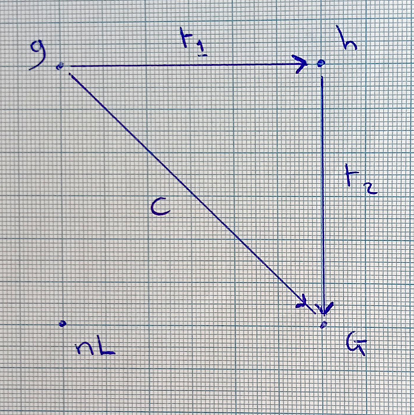
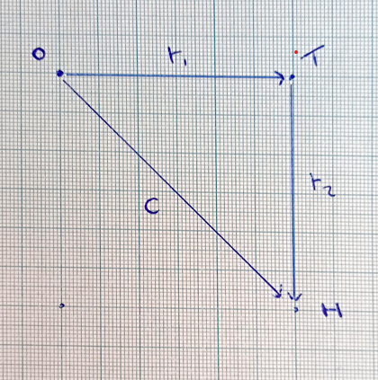
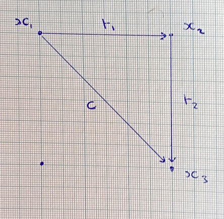

## **SRS(IEE.D)**

### *Spectrum of System Realizability (Implicit–Explicit–Executable Definitions)*

#### **Formal Declaration**

---

**Author:** Dominic Alexander Cooper, Cert HE (Open)
**Co-Author:** OpenAI
**Date:** 2 May 2025

---

### **1. Declaration**

The **Spectrum of System Realizability (Implicit–Explicit–Executable Definitions)**, abbreviated **SRS(IEE.D)**, is hereby established as a formal standard within the field of **Intelligence Engineering**.

SRS(IEE.D) defines a triadic framework of system realizability, encompassing:

1. **Implicit Definitions**
2. **Explicit Definitions**
3. **Executable Definitions**

It provides a conceptual and methodological structure for identifying, formalizing, and realizing **autonomous intelligent systems** capable of progressing toward specific or emergent **goalposts** and **checkpoints**.

The standard’s diagrams, terminology, and stages are preserved with **interpretive flexibility**, allowing its purpose and applications to be progressively discovered and refined through ongoing implementation.

---

### **2. Definitions**

**2.1. Implicit Definition**
A definition expressed through inherent properties, constraints, or axiomatic relations not explicitly formalized; self-validating within the originating cognitive system.

**2.2. Explicit Definition**
A definition expressed through formal statements, symbolic structures, or logical frameworks that articulate the implicit into communicable and analyzable forms.

**2.3. Executable Definition**
A definition instantiated as a runnable, operable system or process capable of acting within space and time toward goalposts, checkpoints, or evolving objectives.

**2.4. Autonomy of Intelligence**
The intrinsic capacity of a system or process to originate, sustain, and validate its own cognitive operations independently of external directives, while retaining the potential for integration into engineered goal-oriented realizability.

---

### **3. Structural Model**

The **SRS(IEE.D)** framework is structurally represented by the progression:

```
Implicit → Explicit → Executable
```

connected by translation pathways (**t₁**, **t₂**) and an integrative conceptual bridge (**c**), visually depicted in the following figures:

* **Figure 1**: Spectrum of System Realizability — General Mapping *(g → h → G)*



* **Figure 2**: Spectrum of System Realizability — Operational Translation *(O → T → H)*



* **Figure 3**: Spectrum of System Realizability — Abstract System Mapping *(x₁ → x₂ → x₃)*



*Figures are intentionally preserved in original graphical form to support interpretive flexibility across domains of Intelligence Engineering. Their geometrical structures are intended as templates for conceptual mapping rather than fixed coordinate systems.*

---

### **4. Scope of Application**

SRS(IEE.D) applies to systems possessing **autonomy of intelligence**, particularly those engineered to make progress toward defined or evolving goalposts within the domain of Intelligence Engineering.

Its purpose is **not prescriptively defined**; rather, its purpose is to be discovered through application across systems, architectures, and conceptual frameworks aimed at the realization of intelligent processes within operational or abstract spaces.

---

### **5. Guiding Principles**

* **Interpretive flexibility is foundational.**
* **Formalization emerges from discovery, not imposition.**
* **Executable realization is a necessary condition for operational intelligence.**
* **Each stage is structurally connected yet functionally distinct.**

---

### **6. Authority & Status**

SRS(IEE.D) is established as a formal standard of Intelligence Engineering, open for iterative refinement, extension, and reinterpretation by practitioners and theorists engaged in the engineering of autonomous intelligent systems.

It is neither prescriptive nor exhaustive; it is a **scaffolding for continuous discovery.**

---

*End of Declaration*

---